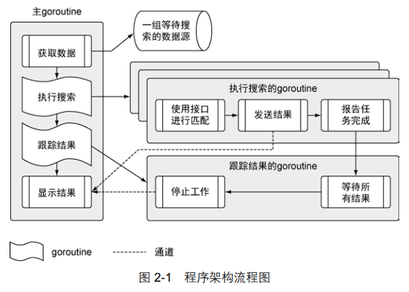

# 02 快速开始 

    这个程序实现的功能很常见，能在很多现在开发的 Go 程序里发现类似的功能。这个程序从不同的数据源拉取数据，将数据内容与一组搜索项做对比，然后将匹配的内容显示在终端窗口。这个程序会读取文本文件，进行网络调用，解码 XML 和 JSON 成为结构化类型数据，并且利用 Go 语言的并发机制保证这些操作的速度。

代码地址：chapter2/sample



## 程序项目与结构目录

```
- sample
  - data
     data.json -- 包含一组数据源
   - matchers
     rss.go -- 搜索 rss 源的匹配器
   - search
     default.go -- 搜索数据用的默认匹配器
     feed.go -- 用于读取 json 数据文件
     match.go -- 用于支持不同匹配器的接口
     search.go -- 执行搜索的主控制逻辑
   main.go -- 程序的入口
```


## main包

```go
package main

import (
	"log"
	"os"

	_ "github.com/goinaction/code/chapter2/sample/matchers"
	"github.com/goinaction/code/chapter2/sample/search"
)

// init is called prior to main.
func init() {
	// Change the device for logging to stdout.
	log.SetOutput(os.Stdout)
}

// main is the entry point for the program.
func main() {
	// Perform the search for the specified term.
	search.Run("president")
}

```

    现在，只要简单了解以下内容：一个包定义一组编译过的代码，包的名字类似命名空间，可以用来间接访问包内声明的标识符。

    这个特性可以把不同包中定义的同名标识符区别开。


    **"import"**，顾名思义就是导入一段代码，让用户可以访问里面的标识符，例如类型、函数、常量和接口，比如main函数里面就引用了 search 包里面的 Run 函数。程序还分别导入了 log 和 os 包。  在第 7 行，导入前有个下划线：

```go
     _ "github.com/goinaction/code/chapter2/sample/matchers"
```

    **这个技术是为了让 Go 语言对包做初始化操作，但是并不使用包里的标识符**。为了让程序的可读性更强，Go 编译器不允许声明导入某个包却不使用。下划线让编译器接受这类导入，并且调用对应包内的所有代码文件里定义的 init 函数。对这个程序来说，这样做的目的是调用 matchers 包中的 rss.go 代码文件里的 init 函数，注册 RSS 匹配器，以便后用。


    代码中也有一个 init 函数，每个文件的 init 函数都会在 main 函数执行前调用。
